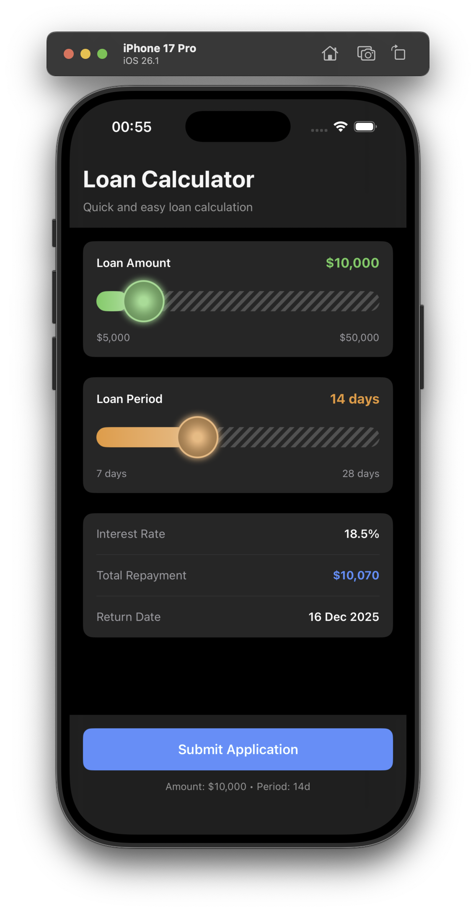
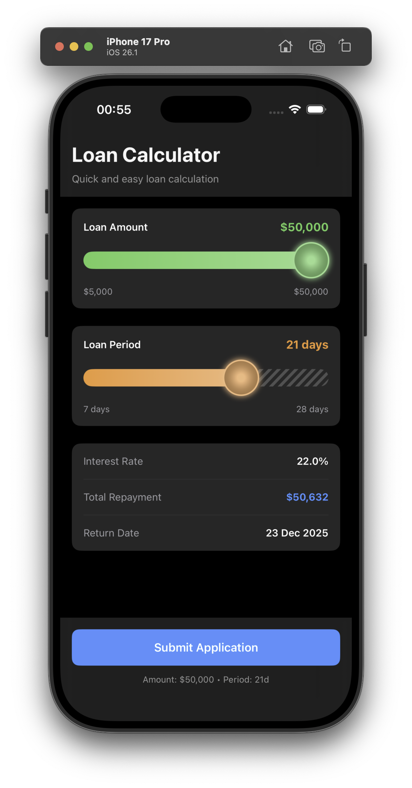
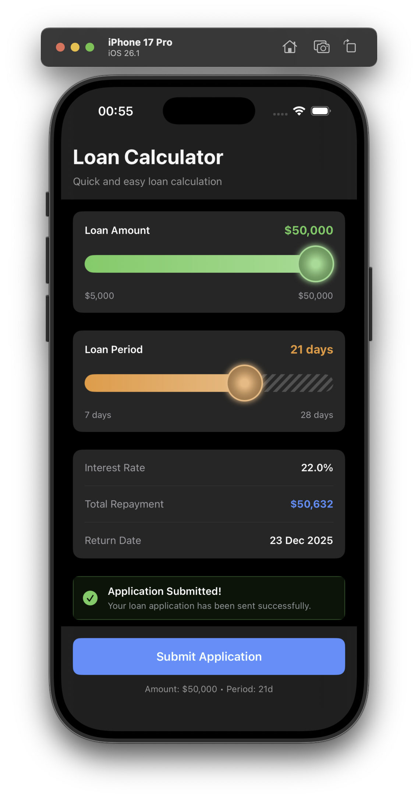
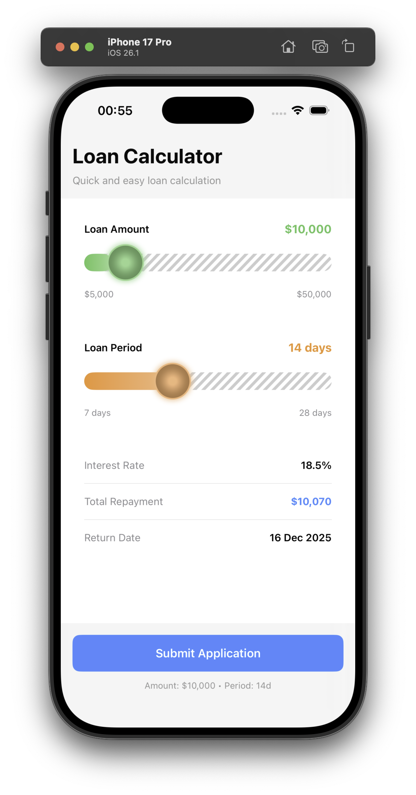
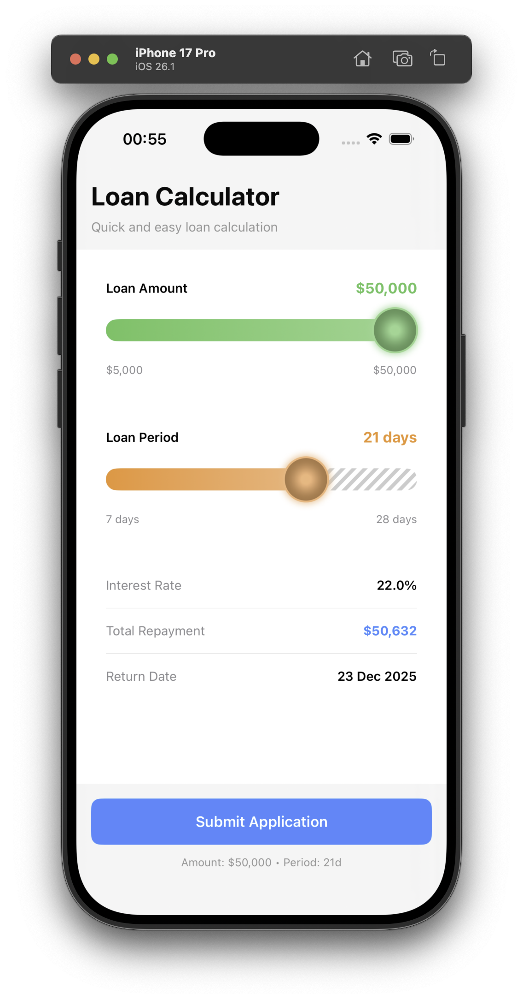
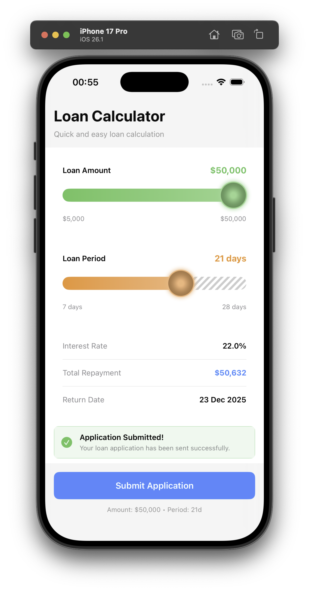

# 💰 Калькулятор Займа

Современное iOS-приложение для расчета параметров микрозайма с интерактивными слайдерами, автоматическим расчетом процентной ставки и возможностью отправки заявки на сервер.

## 📋 Описание проекта

Калькулятор Займа — это полнофункциональное тестовое приложение, демонстрирующее:

- **Redux/UDF архитектуру** с чистым разделением State, Actions и Reducers
- **Кастомные UI компоненты** с плавными анимациями и градиентами
- **Async/await** для работы с сетью без сторонних библиотек
- **Поддержку темной/светлой темы** с автоматическим переключением
- **Персистентность данных** через UserDefaults
- **Unit-тесты** с покрытием ~95% (TDD подход)

### ✨ Основной функционал

- ✅ Слайдер выбора суммы займа (от $5,000 до $50,000)
- ✅ Слайдер выбора срока (7, 14, 21, 28 дней)
- ✅ Автоматический расчет процентной ставки (15% + 0.5% за каждый день свыше 7)
- ✅ Отображение суммы к возврату и даты погашения
- ✅ Отправка заявки на mock API с индикатором загрузки
- ✅ Валидация данных и обработка ошибок
- ✅ Форматирование чисел с разделителями (10,000 вместо 10000)
- ✅ Сохранение последнего выбора пользователя

## 🔧 Системные требования

### Обязательное ПО

- **Xcode**: 16.1 или выше
- **Swift**: 6.0
- **iOS Target**: 18.0+

### Инструменты разработки

- **Tuist**: 4.6.0
- **Git**: Любая актуальная версия

## 📦 Установка

### Установка Tuist

#### Через Homebrew (рекомендуется)
```
brew tap tuist/tuist

brew install --formula tuist@4.6.0
```

## 🚀 Запуск

### Проект

Команда в корне проекта:

```
tuist generate
```

Команда автоматически:
1. Создаст .xcodeproj
2. Разрешит зависимости
3. Откроет Xcode

### Тесты

Команды выполняются в корне проекта:

#### Запустить все тесты

```
tuist test
```

#### Запустить с детальным выводом

```
tuist test --verbose
```

#### Запустить без учета кэша 

```
tuist test --no-selective-testing
```

## 🎬 Демонстрация

### Черная тема

<p align="center">
  
  
  
</p>

### Светлая тема

<p align="center">
  
  
  
</p>